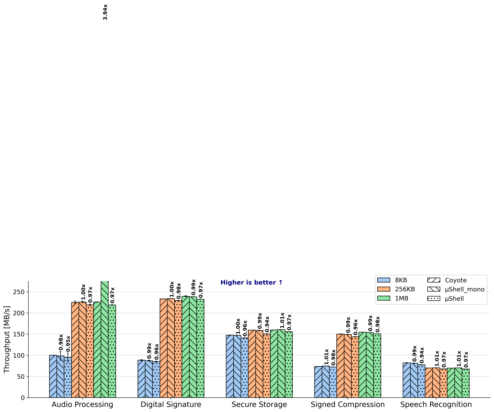
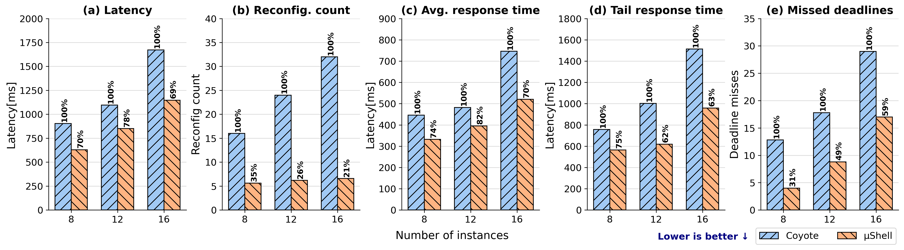
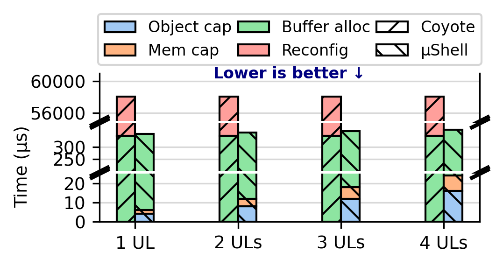

# µShell: a microkernel-based FPGA shell architecture


µShell is a hardware/OS co-design for modular accelerator deployment. Inspired
by the microkernel principle, individual hardware modules (FFT, RSA, AES, …)
are deployed into separate vFPGAs and dynamically chained together by a
host-side dataflow graph (DFG) API to compose end-to-end accelerators.

This repo contains the µShell shell, runtime, driver, example modules, and the
end-to-end applications used in the paper. The accompanying baseline (the same
applications written against an unmodified Coyote shell) lives at
[TUM-DSE/microShell, branch `baseline`](https://github.com/TUM-DSE/microShell/tree/baseline).

## Main Results

<div align="center">
  
  <br/>
  <em>Figure 11 — End-to-end performance: µShell vs. Coyote baseline and a monolithic single-binary variant, across the five composed applications.</em>
</div>

<br/>

<div align="center">
  
  <br/>
  <em>Figure 12 — Component-aware scheduling vs. Coyote's FIFO scheduler, across five metrics: (a) end-to-end latency, (b) reconfiguration count, (c) average response time, (d) tail (95%) response time, (e) deadline misses.</em>
</div>

<br/>

<div align="center">
  
  <br/>
  <em>Figure 13 — Application-deployment overhead: µShell capability/buffer updates vs. Coyote partial-reconfiguration cost, for accelerators of 1–4 user-logic components.</em>
</div>


## Prerequisites

These are the hardware and software environment on our servers. 

### Hardware

- AMD EPYC 7413 CPU × 2
- Xilinx Alveo U280 FPGA × 2
- 100 GbE FPGA-attached NIC
- Bitstream generation (Vivado) and FPGA tests can run on the same host or be
  split across a build host and an FPGA host to keep Vivado off the test path.

### Software

- Linux 6.9.0-rc7 / NixOS 23.11
- [Nix](https://nixos.org/download.html) — all build dependencies are pinned
  via `shell.nix` (host build/run) and `xilinx-shell` (Vivado toolchain)
- Vivado 2022.x (loaded by `xilinx-shell`)
- Python ≥ 3.11 for the plotting scripts under `evaluation/scripts/`


## For OSDI Evaluation Testers

Due to the special hardware and software requirments, we provide ssh access to our evaluation machines so you don't have to help you. Please contact the paper author through hotcrp to obtain ssh keys. The machines will have the correct hardware and also software installed to run the experiments. If you run into problems you can contact us through hotcrp for further questions.


## Getting Started

A "hello world"-equivalent run using `perf_local` — the smallest end-to-end test, a host loop across two vFPGAs.

### 1. Clone the repository

The artifact uses **two** branches of this repo:

- `master` — the µShell shell, runtime, and modular apps
- `baseline` — the same applications written against an unmodified Coyote shell

Both branches need to be cloned and they are used by the [REPRODUCE.md](REPRODUCE.md) commands.

Clone the repo

```bash
cd ~
git clone git@github.com:TUM-DSE/microShell.git 
git clone -b baseline git@github.com:TUM-DSE/microShell.git microShell_base
```

<!-- ### 2. Build the FPGA driver

```bash
nix-shell -p gcc14 gnumake
cd driver
make KERNELDIR=$(nix-build -E '(import <nixpkgs> {}).linuxPackages_6_8.kernel.dev' --no-out-link)/lib/modules/*/build M=$(pwd)
``` -->

<!-- A pre-compiled driver is also shipped with this repo if you want to skip the build. -->


### 2. Program the FPGA

`perf_local` is shipped as a pre-built bitstream under [`bitstreams/perf_local/`](bitstreams/perf_local/). This step installs the pre-compiled FPGA driver on the host and program the FPGA with the specified bitstream.

```bash
cd microShell
bash ./program_fpga.sh perf_local
```

If you see error `rmmod: ERROR: Module coyote_drv is not currently loaded` while the script is running, this is OK and the error can be ignored. 

### 3. Compile perf_local software

```bash
nix-shell shell.nix
mkdir build_perf_local_sw && cd build_perf_local_sw
cmake ../examples_sw/ -DEXAMPLE=perf_local
make
```

### 3. Run the host application
Assuming you are already in `build_perf_local_sw`

```bash
sudo ./bin/test
```

The application reports average throughput across two vFPGAs.

## Detailed Instructions: Reproducing the paper results

All the figures and tables from the paper can be generated using the collected execution data in `evaluation/data/`. The detailed step-by-step flow — bitstream generation, host-side measurements, CSV outputs — lives in [REPRODUCE.md](REPRODUCE.md). 

Assuming your repo is cloned at `~/microShell`, run the following command to set up the environment:

```bash
cd ~\microShell
nix-shell shell.nix
cd evaluation/scripts/
```


### 6.1 Performance (Figure 11)

```bash
python3 e2e_6.1/plot_e2e.py
# → evaluation/plots/e2e_6.1/e2e.{pdf,png}
```

### 6.2 Scheduling Improvements (Figure 12)

```bash
python3 scheduling_6.2/plot_sched.py
# → evaluation/plots/scheduling_6.2/sched.{pdf,png}
```

### 6.3 Application Deployment Overheads (Figure 13)

```bash
python3 deployment_6.3/plot_reconfig_overhead.py
# → evaluation/plots/deployment_6.3/reconfig_overhead.{pdf,png}
```

### 6.4 Programmability (Table 5)

```bash
python3 complexity_6.4/extract_complexity.py \
    --baseline-csv ../data/complexity_6.4/complexity_baseline_results.csv \
    --ushell-csv   ../data/complexity_6.4/complexity_ushell_results.csv
# Prints Table rows to stdout
```

### 6.5 Resource Overheads (Table 6)

```bash
python3 resource_usage_6.5/extract_util.py
# Prints Table 6 rows (Coyote, µShell, Inter 3/4/6/8, PCIe DMA, MMU, CEU) to stdout

python3 resource_usage_6.5/extract_modules.py
# Prints per-module utilization (Figure 5 source) to stdout
```

## Artifact Claims

All figures and tables in §6 of the paper are reproducible with the commands above. Numbers may differ from the paper run depending on system state (driver version, FPGA load, hugepage availability, transient queueing under Vivado-PR). Pre-built bitstreams under [`bitstreams/`](bitstreams/) let
you reproduce the host-side measurements without re-running Vivado.

<!-- | Paper section | Artifact         | Repo plot                                    | Driver scripts                                                    |
|---------------|------------------|----------------------------------------------|-------------------------------------------------------------------|
| §6.1          | Figure 11        | `evaluation/plots/e2e_6.1/e2e.{pdf,png}`             | `compile_hw_*.sh`, `compile_sw_*.sh` → `plot_e2e.py`              |
| §6.2          | Figure 12 (a–e)  | `evaluation/plots/scheduling_6.2/sched.{pdf,png}`           | `examples_sw/apps/scheduler` → `plot_sched.py`                    |
| §6.3          | Figure 13        | `evaluation/plots/deployment_6.3/reconfig_overhead.{pdf,png}` | `examples_sw/apps/reconfigure_shell` → `plot_reconfig_overhead.py` |
| §6.4          | Table 5          | `evaluation/plots/complexity_6.4/complexity.{pdf,png}`      | `measure_complexity_*.sh` → `plot_complexity.py`                  |
| §6.5          | Figures 4–5, Table 6 | `evaluation/plots/{plot_scalability_analysis,resource_efficiency,direct_comm_effectiveness}.pdf` | `compile_scalability.sh`, `compile_effectiveness_*.sh` → `plot_scalability.py`, `plot_efficiency.py`, `plot_effectiveness.py` |

Pre-built bitstreams under [`bitstreams/`](bitstreams/) (one folder per
`EXAMPLE` target) let you skip the 3–4 h Vivado runs and go straight to the
measurement and plotting steps. -->

## Repository Layout

```
microShell/
├── examples_hw/apps/         # HW pipelines (audio_processing, digital_signature, ...)
│   └── modules/              #   single-module bring-ups (fft, rsa, sha256, ...)
├── examples_sw/apps/         # Host programs, mirrors examples_hw
│   ├── *_monolithic/         #   single-binary versions used in §6.1
│   └── modules/              #   per-module test programs
├── sw/{include,src}/         # µShell runtime: DFG API, capabilities, dataflow
├── driver/                   # Linux kernel driver (Coyote-derived)
├── bitstreams/               # Pre-built .bit / .ltx, one folder per EXAMPLE target
├── evaluation/{scripts,data,plots}
├── program_fpga.sh           # Load bitstream + driver + hugepages
├── shell.nix                 # Reproducible build environment
└── REPRODUCE.md              # Full reproduction instructions
```

## Troubleshooting

- **Driver rmmod error** - `rmmod: ERROR: Module coyote_drv is not currently loaded`. This is OK if the script ends with `vm.nr_hugepages = 1024`.
- **Driver won't load** — `sudo rmmod coyote_drv && sudo insmod driver/coyote_drv.ko`. If that fails, reboot and retry; stuck driver state usually clears.
- **FPGA programming fails** — verify `bitstreams/cyt_top.bit` exists before running `program_fpga.sh`. Check `sudo dmesg | tail -50` for PCIe / programming errors.
- **Hugepage shortage** — `cat /proc/sys/vm/nr_hugepages` should be ≥ 1024. Re-run the `sysctl` command if the number resets after reboot.
- **Test process hangs** — `sudo pkill -9 test`, then re-program the FPGA before retrying.
- **bThread could not be obtained, vfid: 0** — This error means the driver is not installed correctly. A reboot is usually needed. 


## License

MIT — see [LICENSE.md](LICENSE.md). Portions derived from
[Coyote](https://github.com/fpgasystems/Coyote) under BSD-3-Clause; original
copyright headers retained per file.

## Citation

```bibtex
@inproceedings{ushell,
  title  = {{µShell}: A Microkernel-based FPGA Shell Architecture},
  author = {TBD},
  year   = {TBD},
  note   = {Citation pending publication.}
}
```