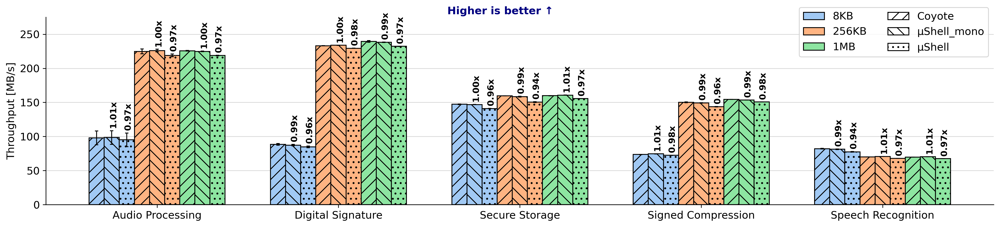
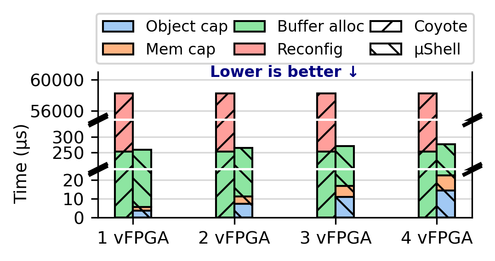

# µShell: A Microkernel-based FPGA Shell Architecture

µShell is a hardware/OS co-design for modular accelerator deployment. Inspired
by the microkernel principle, individual hardware modules (FFT, RSA, AES, …)
are deployed into separate vFPGAs and dynamically chained together by a
host-side dataflow graph (DFG) API to compose end-to-end accelerators.

This repo contains the µShell shell, runtime, driver, example modules, and the
end-to-end applications used in the paper. The accompanying baseline (the same
applications written against an unmodified Coyote shell) lives at
[TUM-DSE/microShell, branch `baseline`](https://github.com/TUM-DSE/microShell/tree/baseline).

---

## Hero results

<div align="center">
  
  <br/>
  <em>End-to-end throughput across the five composed applications, baseline vs. µShell.</em>
</div>

<br/>

<div align="center">
  
  <br/>
  <em>Scheduler comparison: latency, response time, deadline misses, reconfiguration cost across two policies.</em>
</div>

<br/>

<div align="center">
  
  <br/>
  <em>Partial reconfiguration latency breakdown for vFPGA module swaps.</em>
</div>

---

## Hardware & software requirements

| Component | Used in the paper                                              |
|-----------|----------------------------------------------------------------|
| CPU       | 2× AMD EPYC 7413                                               |
| FPGA      | 2× Xilinx Alveo U280 (one per host, for RDMA experiments)      |
| Network   | 100 GbE (FPGA-attached)                                        |
| OS        | NixOS 23.11 / Linux 6.9                                        |
| Tools     | Vivado 2022.x via `xilinx-shell`, Nix, Python ≥ 3.11           |

Two-server workflow: **Amy** runs Vivado bitstream generation, **Clara** runs
FPGA tests. See [`evaluation/scripts/README.md`](evaluation/scripts/README.md).

---

## Repository layout

```
microShell/
├── examples_hw/apps/         # HW pipelines (audio_processing, digital_signature, ...)
│   └── modules/              #   single-module bring-ups (fft, rsa, sha256, ...)
├── examples_sw/apps/         # Host programs, mirrors examples_hw
│   ├── *_monolithic/         #   single-binary versions for the µShell baseline
│   └── modules/              #   per-module test programs
├── sw/{include,src}/         # µShell runtime: DFG, Pipeline, Buffer, ushell::*
├── driver/                   # Linux kernel driver (Coyote-derived)
├── bitstreams/               # Pre-built .bit / .ltx (loaded by program_fpga.sh)
├── evaluation/{scripts,data,plots}
├── program_fpga.sh           # Load bitstream + driver + hugepages
└── shell.nix                 # Reproducible build environment
```

---

## Quick start (perf_local)

`perf_local` is the smallest end-to-end test: a host-side ping/loop across two
vFPGAs, no application logic.

On Clara, with a pre-built `cyt_top.bit` already in `bitstreams/`:

```bash
# 1. Enter the build environment
nix-shell shell.nix

# 2. Load driver, program FPGA, set hugepages
sudo bash ./program_fpga.sh cyt_top
sudo sysctl -w vm.nr_hugepages=1024

# 3. Build and run the host program
cd examples_sw && mkdir build_perf_local && cd build_perf_local
cmake ../ -DEXAMPLE=perf_local
make
cd bin && ./test
```

If you don't have a pre-built bitstream, build one first (Amy):

```bash
xilinx-shell
cd examples_hw && mkdir build_perf_local && cd build_perf_local
cmake ../ -DEXAMPLE=perf_local_2 -DFDEV_NAME=u280
make project && make bitgen          # ~3-4 hours
```

---

## Building from source

### Driver

```bash
nix-shell -p gcc14 gnumake
cd driver
make KERNELDIR=$(nix-build -E '(import <nixpkgs> {}).linuxPackages_6_8.kernel.dev' --no-out-link)/lib/modules/*/build M=$(pwd)
```

### Hardware bitstream

```bash
xilinx-shell
cd examples_hw && mkdir build_<example> && cd build_<example>
cmake ../ -DEXAMPLE=<name> -DFDEV_NAME=u280
make project
make bitgen     # 3-4 h on U280
```

Available `EXAMPLE` targets: see [examples_hw/CMakeLists.txt](examples_hw/CMakeLists.txt).
Composed apps: `audio_processing`, `digital_signature`, `secure_storage`,
`signed_compression`, `speech_recognition` (each with a `_monolithic` variant).
Single modules: `aes_ctr`, `fft`, `quantize`, `rle`, `rsa`, `sha256`, `svm`.

### Host software

```bash
cd examples_sw && mkdir build_<example> && cd build_<example>
cmake ../ -DEXAMPLE=<name>
make
./bin/test                    # default size
./bin/test -s 1048576         # 1 MB transfer
```

Available SW `EXAMPLE` targets: see [examples_sw/CMakeLists.txt](examples_sw/CMakeLists.txt).

---

## Reproducing the paper

Each evaluation section has a dedicated script (or pair of scripts) that
produces a plot under `evaluation/plots/`. The full step-by-step instructions
— including the Amy/Clara split — live in
[`evaluation/scripts/README.md`](evaluation/scripts/README.md). Summary:

| Section                           | Scripts                                                              | Plot output                              |
|-----------------------------------|----------------------------------------------------------------------|------------------------------------------|
| End-to-End Performance Overhead   | `compile_hw_{ushell,baseline}.sh`, `compile_sw_{ushell,baseline}.sh` → `plot_e2e.py` | `plots/e2e.{png,pdf}`                    |
| Programmability                   | `measure_complexity_{ushell,baseline}.sh` → `plot_app_modularity.py` | `plots/application_modularity_analysis.{pdf,png}` |
| Scalability                       | `compile_scalability.sh`, `extract_util.tcl` → `plot_scalability.py` | `plots/plot_scalability_analysis.{pdf,png}` |
| FPGA Acceleration Effectiveness   | `compile_effectiveness_hw.sh`, `compile_effectiveness_sw.sh` → `plot_effectiveness.py` | `plots/direct_comm_effectiveness.pdf`    |
| Scheduling Improvements           | `examples_sw/apps/scheduler` → `plot_sched.py`, `plot_reconf_analysis.py`, `plot_reconfig_overhead.py` | `plots/sched.{png,pdf}`, `plots/reconfig_overhead.{png,pdf}`, `plots/reconf_analysis.pdf` |
| Resource efficiency (supp.)       | `plot_efficiency.py`                                                 | `plots/resource_efficiency.pdf`          |

Each plot script is invoked from `evaluation/scripts/` and writes to
`evaluation/plots/`. Most read either CSVs in `evaluation/data/` or hardcoded
arrays from the paper run; the per-script README documents which.

Pre-built bitstreams under `bitstreams/` let you skip the 3-4 h Vivado runs
and go straight to the SW + plot steps.

---

## Troubleshooting

- **Driver won't load** — `sudo rmmod coyote_drv && sudo insmod driver/coyote_drv.ko`.
- **FPGA programming fails** — verify `bitstreams/cyt_top.bit` exists before running `program_fpga.sh`. Check `sudo dmesg | tail -50`.
- **Hugepage shortage** — `cat /proc/sys/vm/nr_hugepages` should be ≥ 1024.
- **Test process hangs** — `sudo pkill -9 test`, then re-program the FPGA.

---

## License

BSD 3-Clause — see [LICENSE.md](LICENSE.md). Coyote derivative; original
Coyote copyright retained per file.

## Citation

```bibtex
@inproceedings{ushell,
  title  = {{µShell}: A Microkernel-based FPGA Shell Architecture},
  author = {TBD},
  year   = {TBD},
  note   = {Citation pending publication.}
}
```
